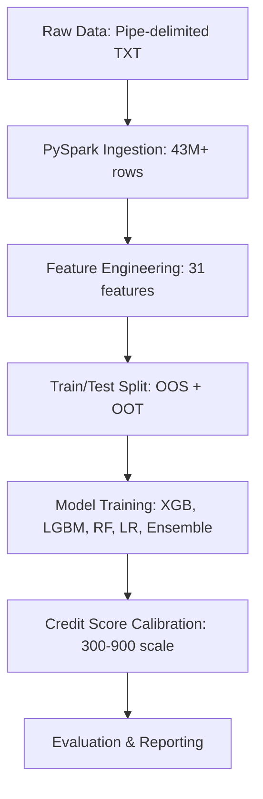

# Freddie Mac Credit Risk Scoring System

## Overview
A production-ready credit risk scoring system that predicts the probability of mortgage borrowers going 90+ days delinquent within the next 12 months. The system generates a credit score (300-900) where higher scores indicate lower default risk.

## Model Performance Summary
Our best model (XGBoost) achieved:
- **AUC-ROC: 0.9858** (98.58% discriminatory power)
- **Gini Coefficient: 0.9716** (Excellent separation)
- **KS Statistic: 0.8893** (Strong default/non-default separation)

### Model Comparison Results
| Model | AUC-ROC | Gini | KS |
|-------|---------|------|-----|
| XGBoost | 0.9858 | 0.9716 | 0.8893 |
| LightGBM | 0.9858 | 0.9716 | 0.8895 |
| Ensemble | 0.9842 | 0.9683 | 0.8864 |
| Random Forest | 0.9823 | 0.9646 | 0.8832 |
| Logistic Regression | 0.9719 | 0.9438 | 0.8531 |

## Data Source
- **Freddie Mac Single-Family Loan-Level Dataset (SFLLD)**
- **Download**: [Freddie Mac SFLLD Website](http://www.freddiemac.com/research/datasets/sf_loanlevel_dataset.page)
- **Note**: We ran this project using the sample files (~200MB) due to laptop storage constraints. The full dataset exceeds 100GB.

## Key Features Identified
Top predictive features from XGBoost:
1. `mean_delinq_12m` - Average delinquency over 12 months (66.7% importance)
2. `max_delinq_12m` - Maximum delinquency over 12 months (17.0% importance)
3. `n_delinq_months_12m` - Count of delinquent months (4.9% importance)
4. `payment_streak` - Consecutive on-time payments (1.6% importance)
5. `orig_year` - Origination year (1.4% importance)

## Score Distribution (300-900 Scale)
| Score Bucket | % of Loans | Default Rate |
|--------------|------------|--------------|
| 300-580 (Very High Risk) | 76.5% | 5.08% |
| 580-620 (High Risk) | 16.0% | 0.01% |
| 620-660 (Medium-High) | 6.4% | 0.01% |
| 660-720 (Medium Risk) | 1.1% | 0.00% |
| 720-760 (Low-Medium) | 0.0% | - |
| 760-900 (Low Risk) | 0.0% | - |

## System Architecture


## 🚀 Getting Started
### Prerequisites
- Windows 10/11, Python 3.9+
- Java 8 (OpenJDK) required for PySpark
- 8GB+ RAM (16GB recommended)
- 10GB free disk space

### Installation
1. Clone the Repository

```Bash
git clone [https://github.com/git-commit-acc/freddie-mac-credit-risk.git](https://github.com/git-commit-acc/freddie-mac-credit-risk.git)
cd freddie-mac-credit-risk
```
2. Create Conda Environment

```Bash
conda create -n freddie_risk python=3.9 -y
conda activate freddie_risk
```
3. Install Dependencies

```Bash
pip install pyspark==3.3.4 pandas numpy scikit-learn xgboost lightgbm scipy matplotlib seaborn jupyter
```
4. Set Java 8 Path
Update JAVA_HOME in your environment variables. Example for Windows:

```DOS
set JAVA_HOME=C:\Program Files\Eclipse Adoptium\jdk-8.0.482.8-hotspot
```
5. Download Data
Download sample files from the Freddie Mac SFLLD website and place them in your configured raw data directory (e.g., D:\Projects\Major Project\dataset\raw_extracted\):

```Plaintext
sample_orig_1999.txt
sample_svcg_1999.txt
... (up to 2012)
```
## 💻 Running the Pipeline
### Quick Start (Run All Stages)
```Bash
python pipeline_complete.py
```
### Run Specific Stages
```Bash
# Data ingestion only
python pipeline_complete.py --stages ingest

# Feature engineering only
python pipeline_complete.py --stages features

# Training and evaluation only (if data is already prepared/cached)
python pipeline_complete.py --stages train evaluate
```
###Interactive Analysis
```Bash
jupyter notebook model_comparison_spark.ipynb
```
## 📂 Project Structure
```Plaintext
freddie_mac_credit_risk_spark/
├── config/
│   └── settings.py              # Configuration parameters & file paths
├── ingestion/
│   └── spark_loader.py          # PySpark raw data parsing
├── features/
│   ├── spark_targets.py         # Target variable construction (12M forward)
│   ├── spark_engineering.py     # Static & dynamic feature creation
│   └── spark_splitting.py       # Train/test validation splits
├── models/
│   ├── spark_trainer.py         # Multi-model training pipeline
│   └── scorer.py                # Probability to Credit Score conversion
├── validation/
│   └── evaluator.py             # AUC, Gini, KS, and ROC generation
├── data/                        # Generated data (created at runtime)
│   ├── parquet/                 # Cleaned tabular data
│   ├── features/                # Engineered features cache
│   ├── splits/                  # Final OOS/OOT splits
│   ├── models/                  # Pickled trained models
│   └── reports/                 # Output evaluation metrics
└── result/                      # Has images of output plots and charts
└── manual_files/                # Has individual function files which can be run in case pipeline fails. (Testing)
│   ├── manual_evaluate.py
│   ├── manual_feature.py
│   ├── manual_split.py
│   ├── manual_train.py
│   ├── manual_train_all.py
├── pipeline_complete.py         # Master pipeline execution script
├── model_comparison_spark.ipynb # Exploratory data analysis & model comparison
└── README.md                    # Project documentation
```
## Output Files
- After successful execution, results are in data/reports/:
- model_comparison.csv - All model metrics
- roc_curves.png - ROC curves comparison
- feature_importance.png - Top 15 features
- score_distribution.csv - Credit score buckets
- pipeline_summary.json - Execution summary

## Interpretation of Credit Scores
| Score Range |	Risk Level |	Business Action
|--------------|------------|--------------|
| 760-900	| Low Risk	| Approve with best rates	|
| 720-760	| Low-Medium | Risk	Standard approval	|
| 660-720	| Medium Risk	| Normal underwriting	|
| 620-660	| Medium-High Risk	| Enhanced scrutiny	|
| 580-620	| High Risk	| Conditional approval	|
| 300-580	| Very High Risk | Decline or high rates	|

## Performance Considerations
- Memory: PySpark processes 43M+ servicing rows efficiently
- Time: Full pipeline ~20-45 minutes on sample files
- Caching: Intermediate results cached in Parquet format

## Troubleshooting
### Java Version Issues
```bash
java -version  # Must show 1.8.x
```
### Out of Memory
```bash
# Reduce year range for testing
python pipeline_complete.py --stages all --start-year 1999 --end-year 2005
```
### Permission Errors
```bash
# Run as Administrator or use different output directory
# Update base_data_dir in config/settings.py
```
## Team Contributions
| Team Member	| Role	| Responsibilities | 
|--------------|------------|--------------|
| Ajinkya Ghodake (M25DE1035)	| Lead: System Design & Data Engineering	| PySpark pipeline architecture, data ingestion, feature engineering, performance optimization | 
| Shubham Verma (M25DE1007)	| Machine Learning & Statistical Modeling	| Model selection, hyperparameter tuning, credit score calibration, evaluation metrics | 

## License
This project is for educational and research purposes.

## Acknowledgments
- Freddie Mac for providing the SFLLD dataset
- Open-source contributors of PySpark, XGBoost, LightGBM, scikit-learn
